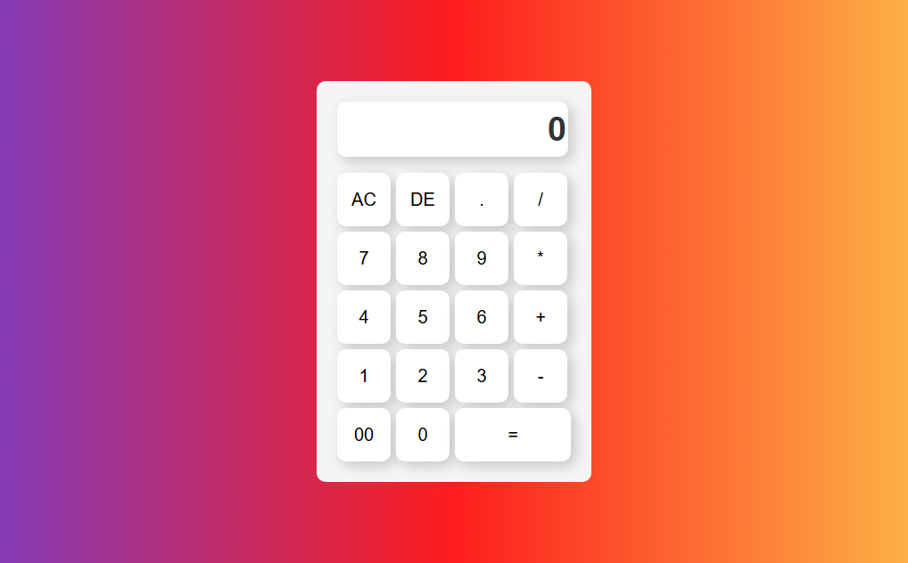

# [calculator math]

This project is a calculator with Proper calculation accuracy

✨ **Live Demo:** [https://omidakharbin.github.io/CalculatorMath/](https://omidakharbin.github.io/CalculatorMath)

## 🚀 Built With

List the major technologies, frameworks, and tools you used.

- 
- 
- 
